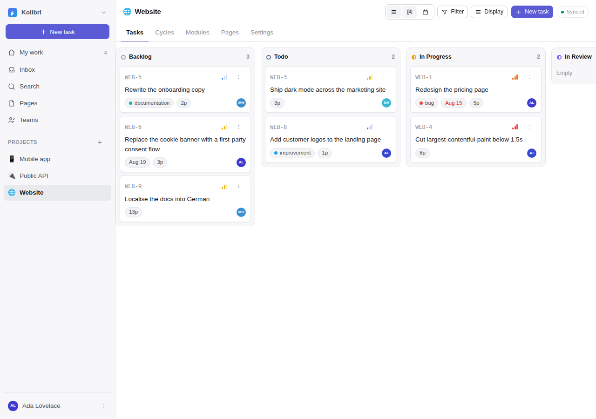
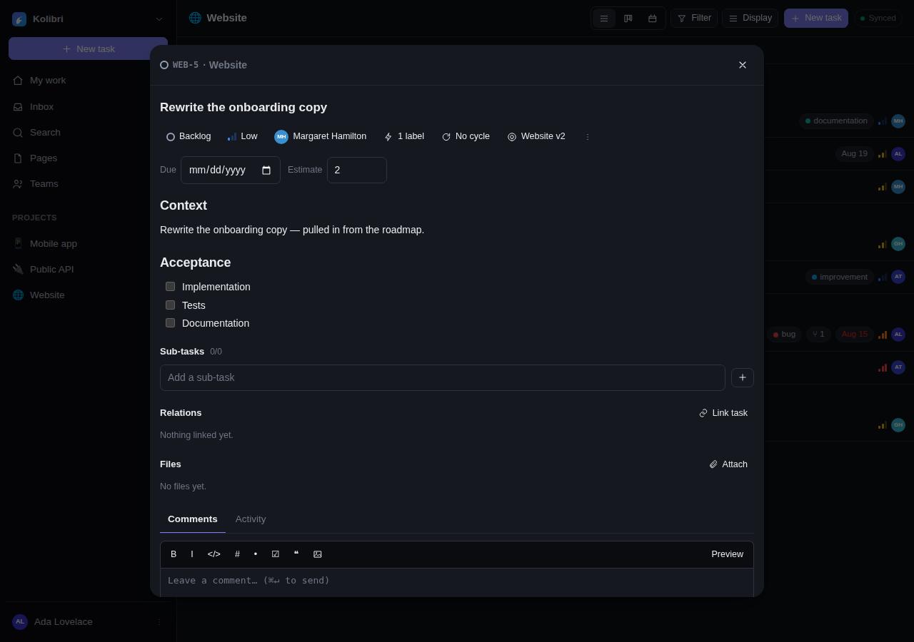
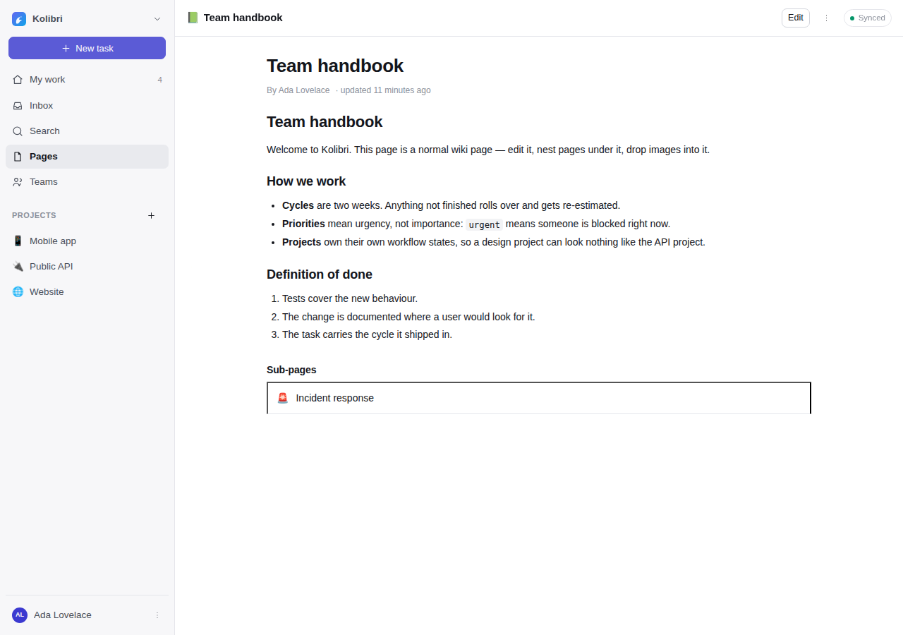
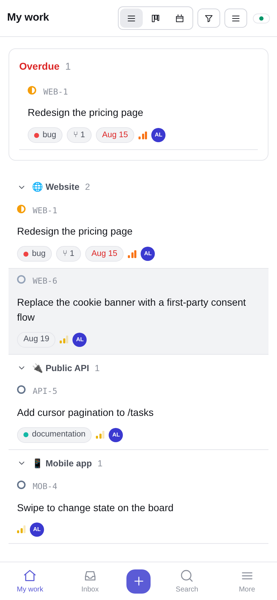

<div align="center">


# Kolibri

**Open source projects, tasks and pages. Offline-first, self-hosted, MCP-native.**

`docker compose up -d` — app and object storage, wired and configured.

</div>

---

Kolibri is a project and work management tool in the spirit of OpenProject and Plane, built
around three convictions:

1. **The interface should never wait for the network.** Every screen reads from a local copy of
   the workspace, so it is instant on a train, on a plane and on hotel wifi. Changes queue up and
   merge field by field when you come back.
2. **Self-hosting should be boring.** One command brings up a complete, self-configuring stack;
   the app itself is one Node process and a SQLite file you can copy — no Postgres, no Redis, no
   worker queue. Strip it down to a single container when that is all you want.
3. **An assistant is a first-class user.** Kolibri speaks the Model Context Protocol natively, so
   an AI can read the backlog, file issues, move them through the workflow and write documentation
   with exactly the permissions you grant it.

<table>
  <tr>
    <td width="50%"></td>
    <td width="50%"></td>
  </tr>
  <tr>
    <td></td>
    <td align="center"></td>
  </tr>
</table>

## What is in the box

| | |
|---|---|
| **Work tracking** | Type a whole task on one line — `Redraw the empty state !high @ada #WEB *design due:friday` — and a token nothing answers to stays in the title rather than vanishing. Projects with their own workflow states, labels and custom fields — nine kinds, asked on every task in the project — tasks with sub-tasks, relations (blocks / relates / duplicates), priorities, estimates, labels, due dates, assignees, archiving, CSV import with a preview before anything is written — parents and blockers resolved on a second pass — exports from Jira, Linear, Plane, OpenProject, Trello and Todoist read by shape, with what cannot come across listed before you commit to it, and a JSON round trip for moving a whole project to another Kolibri |
| **Planning** | Cycles (sprints) with progress and point burn-up, modules (milestones spanning cycles), a timeline where dragging a task moves everything blocked by it — counted in the days the project actually works, with an optional wait on each dependency, and applied on the server too so a date set over the API moves the plan the same way — baselines to draw the plan behind the work, work-in-progress limits, projects that nest under projects — drag one onto another in the sidebar, fold a branch, or mark a project as a **container** that holds only other projects and has no board of its own — teams that own them, any project copyable as a template, time tracking with a timer that survives a reload, an Insights tab per project — throughput, burn-up, cycle time — a portfolio roadmap across all of them, and a team planner where dragging a task between rows hands it over — all computed from the local mirror |
| **Templates & rules** | Task templates with a checklist that becomes sub-tasks, repeating tasks, and rules that file one when something happens — including *n* days before a due date — a task entering review asks the people you named for feedback. Recipients are selectors (the lead, whoever is on it, a team), so they keep meaning the right people |
| **Views** | List, Kanban board with drag & drop and a **+ column** at the right-hand end, table with sortable columns, calendar; group by state / priority / assignee / label / cycle / project — or by a custom field, where dropping a card into a column writes the answer; filter and sort, custom fields included — or **write the filter as text**: `assignee = me AND priority in (urgent, high) AND state != Done`, which prints back from whatever the menus did, so the box and the dropdowns are two views of one thing; select several tasks and change them together; save a view under a name with an icon, pin one as what a project opens on, and share it |
| **Pages** | Nested markdown wiki that two people can edit at the same time — the body is a CRDT, so both sets of changes survive and every device reads the same thing — with version history, restore and a what-changed diff; labels and filtering; watch a page; page templates; per-page visibility; export as a markdown bundle; print or save as PDF; read-only share links for people outside the workspace, which can invite a note back without showing them the thread; comments and `@mentions`, including inline comments on a selected passage that survive the text being edited around them; drag & drop images |
| **Intake** | A link that is a form, for people who have no account and should not need one — no session, no script, works on any phone. What arrives waits in a queue and becomes a task only when somebody accepts it, so nothing from outside lands on the board on its own |
| **Chat** | Channels and direct messages, made of the same synced rows as everything else — so a message sends from a train and arrives when the tunnel ends, with no socket to reconnect. A direct conversation's id is derived from the two people in it, which is why two devices opening one offline end up in one room rather than two half-rooms. Paste a screenshot straight in, react with an emoji, reply to a line. A channel tells you when you are named; turn that up or off per conversation. Private channels keep a member list, and who may change it is settable per channel. A green dot says who is here and a line says who is typing — held in memory, never a row, and carried on the connection that already exists |
| **Collaboration** | Comments with markdown, attachments and reactions on tasks *and* pages, `@mentions` with autocomplete in comments, descriptions and page bodies, following a task or a page, activity trail per task, invite links, roles (owner / admin / member / guest), private projects |
| **Notifications** | In-app inbox, optional email — batched into one message per person, an optional daily or weekly digest, reminders before a due date, per-user preferences, signed one-click unsubscribe, queued with retry, hard bounces suppressed automatically — native push per device, sent with no payload so nothing of yours sits on a push service, and **Telegram**, where the operator configures one bot token and each person connects their own chat from inside the app. Nothing ever learns a phone number: a bot cannot message somebody who has not written to it first |
| **Files** | Content-addressed uploads with de-duplication, client-side image downscaling, offline caching; on the data volume by default, or in any S3-compatible bucket (MinIO, Ceph, R2, AWS) with pre-signed downloads |
| **Offline & sync** | Full IndexedDB mirror, outbox with retry, hybrid-logical-clock last-writer-wins merge per field — except a page body, which is a text CRDT, so two people typing at once keep both paragraphs — Server-Sent-Events live updates, installable PWA. Deletes are tombstones, so nothing is really gone — Settings → Data lists it and brings it back, until an admin empties the trash or a retention window does, which every device then honours |
| **Search** | Instant local title search plus SQLite FTS5 full text across tasks, pages, comments, projects, cycles and chat messages — where a private conversation is checked against its membership before the page of results is trimmed, so it cannot even push a readable hit off the end |
| **Learning it** | A first-run tour that sets the instance up as it goes, a checklist ticked from your actual data, and a guide with animated, narrated diagrams of each area of the app plus an explorer for how the pieces nest. A screen with nothing on it yet links to the card that explains what goes there. Press `?` |
| **Languages** | English, German and French throughout — interface, notifications and emails, each written in the recipient's own language. French is machine-written and says so under the language picker, because an unchecked translation is worth having and worth admitting to. Adding a fourth is one typed catalogue file |
| **Calendar** | A subscribable `.ics` link per person — everything with a due date that is on you, across every workspace — or one per saved view. Google, Apple, Outlook, Thunderbird, DAVx5. `?kind=todo` writes `VTODO` for a client that wants tasks as tasks. The link does not exist until you ask for it and one button makes every copy of the old one stop working |
| **Integration** | REST API for every entity, scoped API tokens, signed outgoing webhooks (Slack and Discord shapes too) and incoming ones that link a commit to the task it names, MCP server over HTTP and stdio with 24 tools, 3 prompts and page resources |
| **Deployment** | One command brings up app + object store, self-configuring: bucket created on boot, owner account and demo data from the environment, optional automatic HTTPS and a dev overlay with a mail capture inbox |
| **Hardening** | Rate limits on sign-in, registration and invite lookup — per account as well as per address — a Content-Security-Policy with no inline script, two-factor authentication with recovery codes, a device list you can revoke from, single sign-on over OpenID Connect with roles mapped from directory groups, per-column rules for who may move work where, and a workspace audit log. A row may only reference rows in its own workspace; an uploaded file is served with its type only if it is on a short inline list, on S3 as well as on disk; a webhook or push endpoint is resolved and checked before the socket is opened and then pinned to the address that passed, so it cannot reach loopback or a cloud metadata service; and an address with a carriage return in it is refused where the message is built, not only where it is typed. See [`docs/security.md`](docs/security.md) |

## Quick start

```bash
git clone https://github.com/LucaFrankfurt/AIfirstPMO.git kolibri
cd kolibri
docker compose up -d --build
open http://localhost:4000
```

That is the whole installation. It brings up the app and an S3-compatible object store for uploads,
**already wired to each other** — the bucket is created on first boot and nothing has to be
configured afterwards.

| | |
|---|---|
| App | <http://localhost:4000> |
| Object store console | <http://localhost:9001> — login is `KOLIBRI_S3_ACCESS_KEY` / `KOLIBRI_S3_SECRET_KEY`, bound to localhost |

Email is **off** until `KOLIBRI_SMTP_URL` points at a relay you control — notifications live in the
in-app inbox either way. To try delivery locally, add the dev overlay, which runs a capture inbox
(Mailpit on <http://localhost:8025>) and wires the app to it:

```bash
docker compose -f docker-compose.yml -f docker-compose.dev.yml up -d --build
```

Kolibri recognises a capture inbox and labels it as such in the log, in `/api/health` and in the
settings screen, so it can never be mistaken for real delivery.

To skip the browser step that claims the instance, set the owner in `.env` before the first start
— the account then exists the moment the stack is up:

```bash
cp .env.example .env
# KOLIBRI_ADMIN_EMAIL=you@example.com
# KOLIBRI_ADMIN_PASSWORD=something long
# KOLIBRI_SEED_DEMO=true      ← optional demo workspace to look around in
docker compose up -d --build
```

Otherwise the first account you create in the browser owns the instance. Either way, set
`KOLIBRI_ALLOW_SIGNUP=false` afterwards and invite the rest of the team from **Settings → Members**.

**Variants**

```bash
docker compose -f docker-compose.lite.yml up -d --build   # single container, uploads on the volume
docker compose --profile tls up -d                        # + Caddy, automatic HTTPS for KOLIBRI_DOMAIN
```

Put `COMPOSE_FILE=docker-compose.yml:docker-compose.dev.yml` in `.env` and plain
`docker compose up -d` picks up the overlay every time.

Deploying on **Coolify** or a similar PaaS? Use the Docker Compose build pack with
`docker-compose.coolify.yml` — it drops the host port mappings, fixed container names and the
bundled TLS proxy, because the platform provides all three. See
[`docs/deployment.md`](docs/deployment.md#coolify-and-other-paas).

### Without Docker

Node 22.18 or newer is the only requirement — the server runs TypeScript directly and SQLite is
built into Node.

```bash
npm install
npm run build          # bundles the web app into packages/web/dist
npm run seed           # optional demo workspace (ada@kolibri.dev / kolibri-demo)
npm start              # http://localhost:4000
```

For development, run the API and the Vite dev server side by side:

```bash
npm run dev:server     # :4000
npm run dev:web        # :5173, proxies /api to :4000
```

## Connect an assistant (MCP)

Create a token under **Settings → API & MCP**, then point a client at the instance. Anything that
speaks streamable HTTP needs nothing installed — the tools are in the server:

```bash
claude mcp add --transport http kolibri https://kolibri.example.com/mcp \
  --header "Authorization: Bearer kol_…"
```

A client that only speaks stdio runs the bridge in `packages/mcp`, which pipes JSON-RPC to that same
endpoint. And **Claude on the web** takes neither: add the instance URL as a custom connector and
sign in when it asks — the instance is an OAuth authorization server for exactly that case, and what
it grants is an ordinary token you can revoke in Settings. See [`docs/mcp.md`](docs/mcp.md).

Tools: `list_workspaces`, `list_projects`, `create_project`, `list_tasks`, `get_task`,
`create_task`, `update_task`, `delete_task`, `comment_task`, `search`, `list_templates`,
`apply_template`, `list_cycles`, `create_cycle`, `list_pages`, `get_page`, `create_page`,
`update_page`, `list_members`, `list_labels`, `project_status`, `my_work`, `log_time`, `list_time`.
Prompts: `standup`, `sprint_planning`, `triage`.

A read-only token (`scopes: "read"`) is refused for every write tool, so you can hand an assistant
a view of the backlog without handing it a pen.

## How the offline sync works

```
 browser                                  server
┌──────────────────────────┐             ┌───────────────────────────────┐
│ UI reads from IndexedDB  │             │ SQLite, one row per entity    │
│           ▲              │  POST push  │ + per-field HLC stamps        │
│  writes ──┼──► outbox ───┼────────────►│ last-writer-wins per field    │
│           │              │             │ + monotonic `seq` counter     │
│  applyChanges ◄──────────┼─ GET pull ──┤ "everything after seq N"      │
│           ▲              │             │                               │
│           └──── SSE ─────┼─────────────┤ "workspace moved to seq N"    │
└──────────────────────────┘             └───────────────────────────────┘
```

Each mutation carries a hybrid logical clock stamp and a client-generated id. The server keeps a
stamp **per field**, so two people editing the same task offline — one the title, one the priority —
both keep their change instead of one silently winning. Replayed pushes are ignored by mutation id,
so a flaky connection cannot duplicate a task. Details and trade-offs: [`docs/sync.md`](docs/sync.md).

## Documentation

- [`TODO.md`](TODO.md) — what is missing, what is unverified, what was deferred on purpose
- [`docs/comparison.md`](docs/comparison.md) — an honest gap analysis against Jira, Confluence,
  Plane, Vikunja and OpenProject, and the order those gaps are worth closing in
- [`docs/architecture.md`](docs/architecture.md) — how the pieces fit together, including
  [why there is no Redis or Postgres, and why S3 and email are optional](docs/architecture.md#why-no-redis-or-postgres--and-why-s3-and-email-are-optional)
- [`docs/sync.md`](docs/sync.md) — the offline protocol, conflict rules and failure modes
- [`docs/automation.md`](docs/automation.md) — task templates, rules, who gets the task and why one might not fire
- [`docs/notifications.md`](docs/notifications.md) — in-app, email, Web Push and Telegram delivery, batching, mentions
- [`docs/chat.md`](docs/chat.md) — channels and direct messages, why a direct conversation has no id of its own, and what is deliberately not in it
- [`docs/time.md`](docs/time.md) — logging time, what a running timer actually is, and what it is not
- [`docs/import.md`](docs/import.md) — bringing a backlog in from a CSV or another tool's export, and what it does with a row it cannot read
- [`docs/query.md`](docs/query.md) — the two small languages: a task on one line, and a filter as text
- [`docs/calendar.md`](docs/calendar.md) — the `.ics` feed, what a subscription is worth, and why the URL is a password
- [`docs/insights.md`](docs/insights.md) — throughput, burn-up and cycle time, and the rules the charts follow
- [`docs/design.md`](docs/design.md) — the tokens, the type scale, the ten rules that are not about
  looks, what the accessibility pass found, and the order to port a screen in
- [`docs/i18n.md`](docs/i18n.md) — how a language is picked, and how to add one
- **The guide inside the app** (`?` or the sidebar) — what every feature does, how the
  pieces nest, and the shortcuts. It is the manual for using Kolibri; the files here are the
  manual for running and extending it.
- [`docs/storage.md`](docs/storage.md) — disk vs. S3/MinIO, pre-signed downloads, migrating
- [`docs/api.md`](docs/api.md) — REST endpoints, auth, uploads
- [`docs/mcp.md`](docs/mcp.md) — every tool, prompt and resource with examples
- [`docs/security.md`](docs/security.md) — the threat model, what is checked and where, what has
  been reviewed and what has not
- [`docs/deployment.md`](docs/deployment.md) — TLS, backups, upgrades, environment variables

## Testing

```bash
npm test          # API, sync merge, permissions, uploads, injection, MCP, SMTP, S3, translations
npm run typecheck # every package, plus the client test project
node scripts/smoke.mjs                    # browser walkthrough incl. mobile + offline (needs Playwright)
KOLIBRI_LOCALE=de node scripts/smoke.mjs  # the same walk through the German interface
KOLIBRI_LOCALE=fr node scripts/smoke.mjs  # and the French one
```

The mail tests run against a real SMTP server implemented in the test, and the storage tests
against a fake S3 that verifies the request signature — so both protocols are exercised, not
mocked.

Four more checks measure the interface in a real browser rather than asserting about the source,
because "it has an `aria-label` somewhere" and "the grey is fine" are both claims that have been
wrong here. Each needs a seeded instance on `KOLIBRI_URL` (default `http://localhost:4400`):

```bash
npm run check:css         # every class the source uses is actually defined — no build needed
npm run check:responsive  # 13 screens, 340px to 1600px in 20px steps, looking for overflow
npm run check:contrast    # WCAG ratios for every element that renders text, light and dark
npm run check:a11y        # names, keyboard reach, focus rings, landmarks, 24px targets
```

They are not decoration. `check:contrast` found twenty unreadable places on its first run,
`check:responsive` found a layout that came apart between 880 and 940 pixels, and `check:a11y`
found forty-four problems including the checkbox in front of every task.

## Project layout

```
packages/
  shared/   types, entity registry, hybrid logical clock, fractional indexing
  server/   HTTP API, sync engine, MCP server, SQLite schema — zero runtime dependencies
  web/      React PWA: local store, sync engine, views, editor
  mcp/      stdio ⇄ HTTP bridge for MCP clients that cannot speak HTTP
```

## Contributing

Issues and pull requests are welcome. Run `npm test && npm run typecheck` before opening one.
The codebase deliberately avoids frameworks on the server and heavyweight dependencies on the
client — please keep new dependencies to a minimum and say why one is needed.

## Licence

MIT — see [LICENSE](LICENSE).
